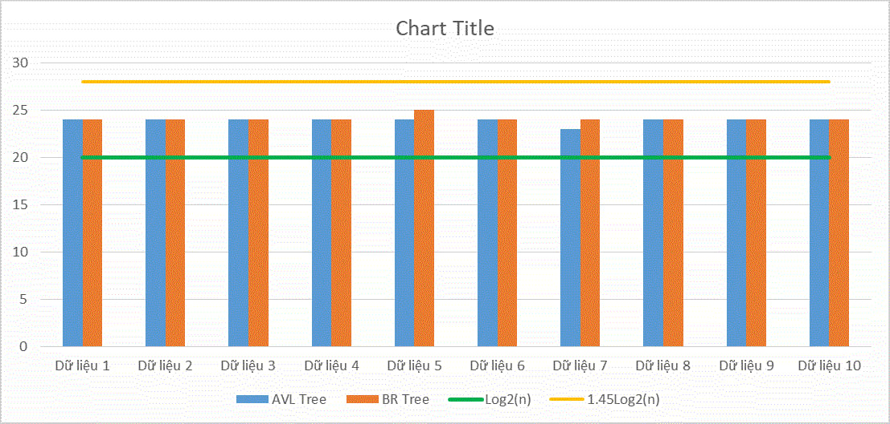

# Binary-Tree-report
Compare the height of two types of Binary Tree: AVL Tree and Black - White Tree

# Folder management
1. The source of AVL and Black-Red Tree were built as modulo(C) and its in <a href="https://github.com/trannhatkhoacm1612/Binary-Tree-report/tree/main/modulo">modulo</a> folder.

2. 10 dataframes were render by python in <a href="https://github.com/trannhatkhoacm1612/Binary-Tree-report/tree/main/data">data</a> folder and how to render it that be in <a href="https://github.com/trannhatkhoacm1612/Binary-Tree-report/tree/main/processing">preprocessing</a> folder.

3. How Read and write 10 heights of 10 dataframes is in <a href="https://github.com/trannhatkhoacm1612/Binary-Tree-report/tree/main/write_file">write_file</a> folder and the height of each Tree be in <a href="https://github.com/trannhatkhoacm1612/Binary-Tree-report/tree/main/result">result</a>.
